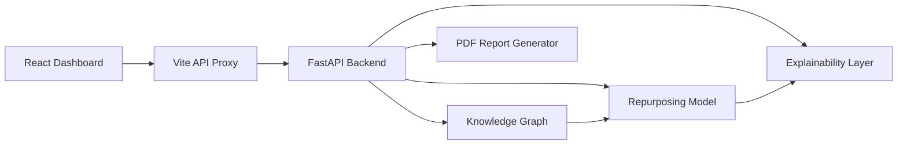

# Nebula

### AI-guided drug repurposing dashboard with knowledge graphs and explainable scoring


Nebula is a student-built full-stack prototype for exploring **drug repurposing candidates**. It combines a small biomedical knowledge graph, model-based confidence scoring, explainable AI style breakdowns, citation evidence, and an interactive React dashboard.

> **Academic disclaimer:** This project is for research and learning demonstration only. It is not medical advice and should not be used for clinical decision-making.


## What It Does

Nebula lets a user choose a disease and inspect possible drug repurposing candidates. The dashboard separates predicted candidates from known approved treatments, then gives supporting evidence through graph relationships, confidence score breakdowns, drug comparison, and PDF reporting.

The project was built to answer a simple learning question:

> Can a small knowledge graph plus explainable scoring make drug repurposing predictions easier to inspect?

## Core Features

- **Candidate ranking** for selected diseases
- **Known treatment separation** so approved drugs do not look like new discoveries
- **Knowledge graph view** connecting diseases, drugs, genes, and pathways
- **Shortest KG path explanation** for network-distance based reasoning
- **Confidence score breakdown** using network, pathway, target, and literature signals
- **SHAP-style explainability panel** with biological rationale
- **Drug comparison module** for side-by-side candidate review
- **PubMed-style evidence cards** for supporting references
- **PDF report download** for a selected disease
- **Responsive dashboard UI** for presentation demos

## Tech Stack

| Layer | Tools |
| --- | --- |
| Frontend | React, TypeScript, Vite, Tailwind CSS |
| Visualization | Cytoscape.js, Recharts, Lucide Icons |
| Backend | FastAPI, Python |
| Graph / Model Logic | NetworkX, scikit-learn / XGBoost-style scoring |
| Explainability / Reports | SHAP-style logic, ReportLab |

## Repository Structure

```text
Drug_repurposing/
├── backend/
│   ├── app.py                # FastAPI routes
│   ├── knowledge_graph.py    # biomedical graph construction and queries
│   ├── model.py              # candidate scoring logic
│   ├── explainability.py     # explanation and confidence breakdown
│   ├── report_generator.py   # PDF report generation
│   └── requirements.txt
├── frontend/
│   ├── src/
│   │   ├── App.tsx
│   │   └── components/
│   ├── package.json
│   └── vite.config.ts
├── docs/
│   ├── ARCHITECTURE.md
│   ├── DEPLOYMENT.md
│   └── screenshots/
├── run.sh
└── README.md
```

## System Flow



## Running Locally

Make sure you have **Python 3** and **Node.js** installed.

```bash
git clone https://github.com/Infinity-418/Drug_repurposing.git
cd Drug_repurposing
chmod +x run.sh
./run.sh
```

Open the frontend:

```text
http://localhost:5173
```

Backend API:

```text
http://localhost:8000
```

## API Endpoints

| Endpoint | Purpose |
| --- | --- |
| `GET /api/diseases` | List available diseases |
| `GET /api/predict/{disease_id}` | Return repurposing candidates |
| `GET /api/explain/{drug_id}/{disease_id}` | Return explanation, citations, and mechanism data |
| `GET /api/graph/{disease_id}/{drug_id}` | Return graph nodes and edges |
| `GET /api/compare/{drug_a_id}/{drug_b_id}/{disease_id}` | Compare two drugs |
| `GET /api/report/{disease_id}` | Download PDF report |

## Demo Notes

For an investigator or viva-style demo, the most reliable method is to run the project locally and screen share:

```bash
./run.sh
```

Then open:

```text
http://localhost:5173
```

More sharing options are documented in [docs/DEPLOYMENT.md](docs/DEPLOYMENT.md).

## Limitations

- The biomedical graph is small and curated for demonstration.
- Confidence scores are prototype scores, not clinically validated probabilities.
- Literature evidence is shown for exploration, not as a complete systematic review.
- The current deployment flow is best suited for local demos.

## Future Improvements

- Add larger biomedical datasets
- Improve evidence grading for clinical / review / preclinical sources
- Add filters for confidence tier, evidence count, and shortest KG path
- Improve graph label readability on mobile
- Add a hosted backend and stable public demo link
- Add user authentication if deployed publicly

## About This Project

This was made as a student prototype to practice full-stack development, biomedical graph modeling, and explainable AI presentation. The focus is on making model output understandable rather than claiming clinical accuracy.
