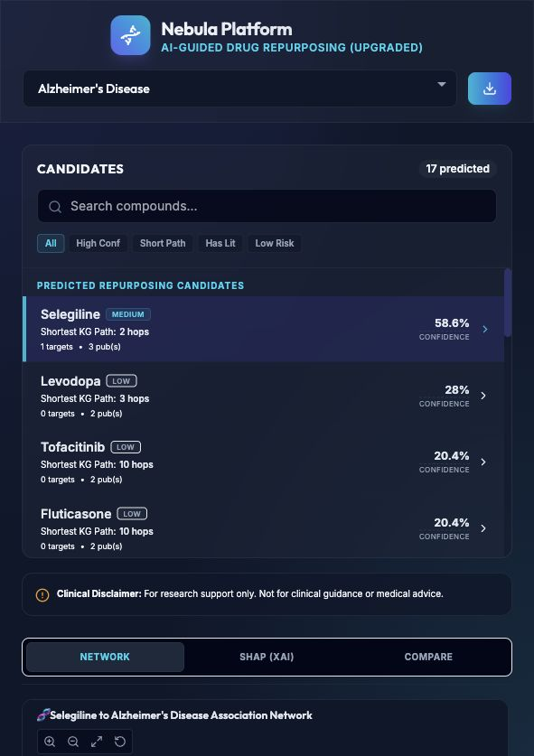
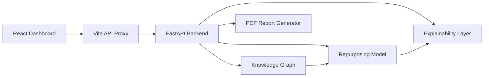

# Nebula 🪐

### AI-Guided Drug Repurposing Dashboard with Knowledge Graphs and Explainable Scoring

[](https://github.com/Infinity-418/Drug_repurposing/actions/workflows/ci.yml)
[](docker-compose.yml)
[](LICENSE)
[](#tech-stack)
[](#tech-stack)

Nebula is a student-built full-stack prototype for exploring **drug repurposing candidates**. It combines a small biomedical knowledge graph, model-based confidence scoring, explainable AI-style breakdowns, citation evidence, and an interactive React dashboard.

> ⚠️ **Academic disclaimer:** This project is for research and learning demonstration only. It is not medical advice and should not be used for clinical decision-making.



---

## Table of Contents

- [What It Does](#what-it-does)
- [Core Features](#core-features)
- [Tech Stack](#tech-stack)
- [Repository Structure](#repository-structure)
- [System Flow](#system-flow)
- [Getting Started](#getting-started)
  - [Method 1: Running with Docker (Recommended)](#method-1-running-with-docker-recommended)
  - [Method 2: Running Locally (Scripted)](#method-2-running-locally-scripted)
  - [Method 3: Manual Installation](#method-3-manual-installation)
- [API Endpoints](#api-endpoints)
- [Demonstration & Sharing Guide](#demonstration--sharing-guide)
- [Limitations & Future Improvements](#limitations--future-improvements)
- [License](#license)

---

## What It Does

Nebula lets an investigator choose a disease and inspect potential drug repurposing candidates. The dashboard separates predicted candidates from known approved treatments, then gives supporting evidence through:
1. **Graph relationships** mapping drug-target-disease nodes.
2. **Confidence score breakdowns** based on multi-source biological signals.
3. **SHAP-style explainability panels** detailing biological feature rationale.
4. **Side-by-side drug comparison** for comparing candidate drugs.
5. **PDF reporting** for offline downloading and review.

---

## Core Features

- **Candidate ranking** for selected diseases.
- **Known treatment separation** so approved drugs do not look like new discoveries.
- **Knowledge graph view** connecting diseases, drugs, genes, and pathways using Cytoscape.js.
- **Shortest KG path explanation** for network-distance based reasoning.
- **Confidence score breakdown** using network, pathway, target, and literature signals.
- **SHAP-style explainability panel** with biological rationale.
- **Drug comparison module** for side-by-side candidate review.
- **PubMed-style evidence cards** for supporting references.
- **PDF report download** for a selected disease.
- **Responsive dashboard UI** for presentation demos.

---

## Tech Stack

| Layer | Tools | Description |
| --- | --- | --- |
| **Frontend** | React, TypeScript, Vite, Tailwind CSS | Responsive interactive dashboard |
| **Visualization** | Cytoscape.js, Recharts, Lucide Icons | Interconnected pathway and KG rendering |
| **Backend** | FastAPI, Python, Uvicorn | High-performance asynchronous API endpoints |
| **Graph / Model** | NetworkX, scikit-learn | Graph calculations, shortest paths, XGBoost-style candidate scoring |
| **Explainability** | SHAP-style breakdown logic | Rationale and confidence feature weight distribution |
| **Reports** | ReportLab | Programmatic generation of PDF summaries |
| **Containerization** | Docker, Docker Compose | Consistent multi-container deployment |

---

## Repository Structure

```text
Drug_repurposing/
├── .github/
│   ├── ISSUE_TEMPLATE/       # Professional issue reporting
│   └── workflows/            # GitHub Actions CI workflow (Python tests & Node build)
├── backend/
│   ├── app.py                # FastAPI routes
│   ├── knowledge_graph.py    # Biomedical graph construction and queries
│   ├── model.py              # Candidate scoring logic
│   ├── explainability.py     # Explanation and confidence breakdown
│   ├── report_generator.py   # PDF report generation
│   ├── test_backend.py       # API unit tests
│   ├── requirements.txt      # Python dependencies
│   └── Dockerfile            # Container deployment definition for backend
├── frontend/
│   ├── src/
│   │   ├── App.tsx           # React main hub
│   │   └── components/       # Graph Explorer, Analytics Panel, etc.
│   ├── package.json          # Node dependencies
│   ├── vite.config.ts        # Vite routing/proxy configurations
│   └── Dockerfile            # Container deployment definition for frontend
├── docs/
│   ├── ARCHITECTURE.md       # Deeper look into design choices
│   ├── DEPLOYMENT.md         # Deployment variations and Wi-Fi sharing guide
│   └── screenshots/          # Documentation assets
├── docker-compose.yml        # Multi-container orchestration config
├── run.sh                    # Automation runner for dev servers
└── README.md                 # Project summary (you are here)
```

---

## System Flow



---

## Getting Started

Make sure you have [Docker](https://www.docker.com/) (for Method 1) OR **Python 3** and **Node.js** (for Method 2 & 3) installed.

### Method 1: Running with Docker (Recommended)

Run the entire application stack concurrently in containerized mode with hot-reloading enabled.

```bash
# Clone the repository
git clone https://github.com/Infinity-418/Drug_repurposing.git
cd Drug_repurposing

# Build and start services
docker compose up --build
```

- React Frontend will be available at: [http://localhost:5173](http://localhost:5173)
- FastAPI Backend API will be available at: [http://localhost:8000](http://localhost:8000)

### Method 2: Running Locally (Scripted)

You can run the interactive setup shell script, which takes care of setting up your Python virtual environment, installing Python/Node dependencies, and launching the services concurrently:

```bash
chmod +x run.sh
./run.sh
```

### Method 3: Manual Installation

If you prefer to start each service manually:

**1. Setup & Start Backend**
```bash
cd backend
python3 -m venv venv
source venv/bin/activate
pip install -r requirements.txt
python3 -m uvicorn app:app --port 8000 --reload
```

**2. Setup & Start Frontend**
```bash
cd frontend
npm install
npm run dev
```

---

## API Endpoints

| Endpoint | Method | Purpose |
| --- | --- | --- |
| `/api/diseases` | `GET` | List available diseases in the biomedical graph |
| `/api/predict/{disease_id}` | `GET` | Return predicted repurposing candidates and known approved treatments |
| `/api/explain/{drug_id}/{disease_id}` | `GET` | Return SHAP explainability, PubMed-style evidence, and target nodes |
| `/api/graph/{disease_id}/{drug_id}` | `GET` | Return subgraph elements (nodes/edges) for Cytoscape visualization |
| `/api/compare/{drug_a_id}/{drug_b_id}/{disease_id}` | `GET` | Compare two candidates side-by-side |
| `/api/report/{disease_id}` | `GET` | Generate and download a PDF summary report |

---

## Demonstration & Sharing Guide

If you are demonstrating this project during a viva, review, or presentation:
- **Laptop Zoom/Meet presentation:** Use **Method 1** or **Method 2** and share your screen.
- **Wi-Fi Sharing:** You can host the servers locally on your machine and let investigators access it from their mobile/tablet screens under the same local Wi-Fi. Check instructions in [docs/DEPLOYMENT.md](docs/DEPLOYMENT.md).
- **Public URL Sharing:** Instructions on setting up temporary tunnels (like ngrok) or proper online deployment are detailed in [docs/DEPLOYMENT.md](docs/DEPLOYMENT.md).

---

## Limitations & Future Improvements

- **Curated Dataset:** The biological graph database is simplified for presentation logic. Real-world scaling requires importing larger databases (e.g., PrimeKG, Hetionet).
- **Inference Reliability:** Candidate scores are computed via mock weights and heuristics, which are perfect for XAI exploration but not clinically validated.
- **Pathways & Mobile:** Graph visualization scales dynamically, but readability might decrease on narrow screens.
- **Future Goals:** Integrate Graph Neural Networks (GNNs), add automated PubMed citation retrieval API pipelines, and publish Docker containers to registries.

---

## License

This project is open-source and available under the [MIT License](LICENSE).
