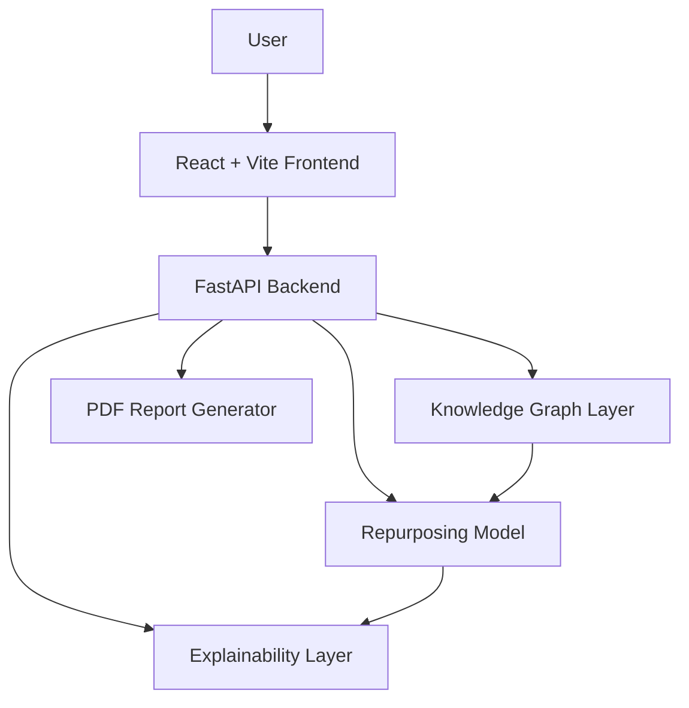

# Architecture

Nebula is a full-stack student prototype with a React frontend and FastAPI backend.

## High-Level Design



## Frontend

The frontend is responsible for:

- disease selection
- candidate list rendering
- graph visualization
- SHAP-style explanation panels
- drug comparison UI
- report download actions

Important files:

```text
frontend/src/App.tsx
frontend/src/components/GraphExplorer.tsx
frontend/src/components/AnalyticsPanel.tsx
```

## Backend

The backend exposes API endpoints and coordinates graph/model/explanation logic.

Important files:

```text
backend/app.py
backend/knowledge_graph.py
backend/model.py
backend/explainability.py
backend/report_generator.py
```

## Data / Model Notes

The current project uses a small curated graph and prototype scoring logic. It is suitable for demonstrating system design and explainability, not for medical decision-making.

## Local Development Ports

```text
Frontend: http://localhost:5173
Backend:  http://localhost:8000
```
